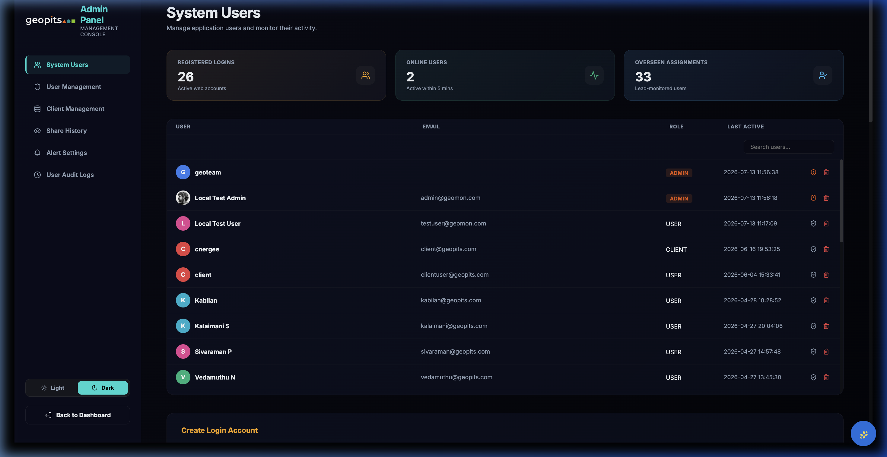
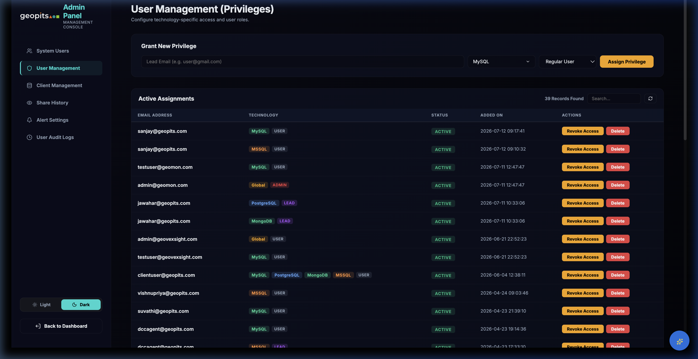
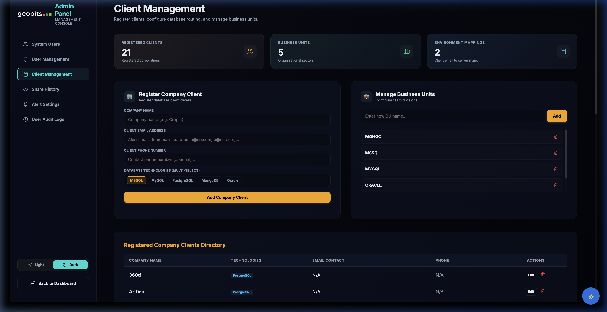
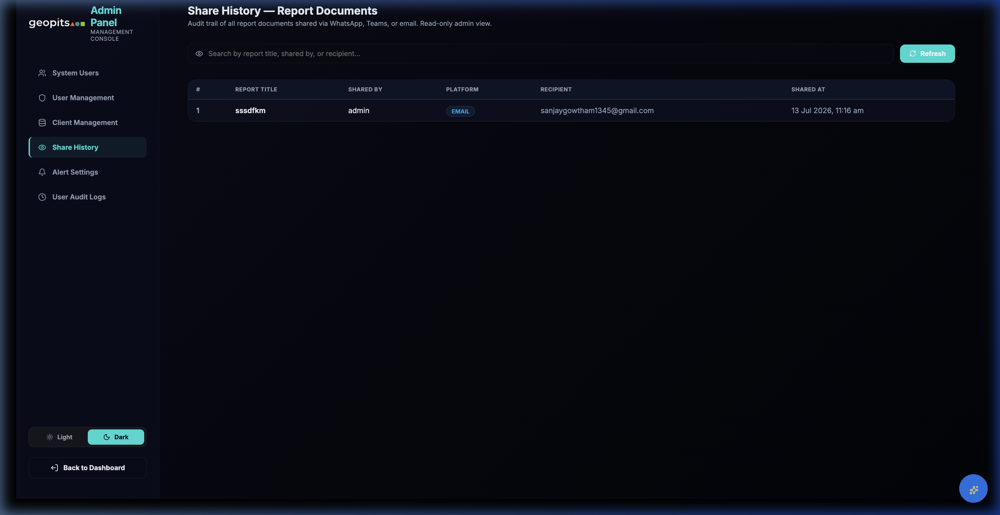
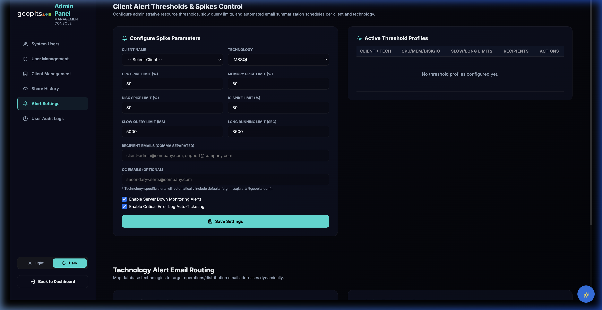
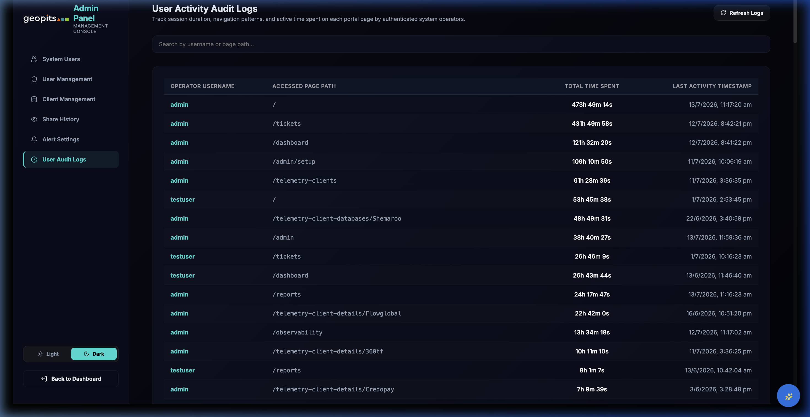

# GeoMon Admin Panel Interface Specification

This document presents the visual interface specifications and layouts for all 6 core administrative modules of **GeoMon**. The screenshots are captured directly from the live application and are located in the `./wireframes` directory.

---

## 🎨 Theme & Layout Matrix

* **Design Pattern:** Glassmorphic layout using `themeStyles` defined in `AdminSetup.jsx`.
* **Color Palette:** Curated dark-themed workspace with custom-rendered badges for roles and database technologies.
* **Layout Structure:** A sticky navigation sidebar on the left and a scrollable workspace card grid on the right.

---

## 📂 Admin Modules & Layouts

### 👤 1. System Users
The main directory for managing operator accounts and credentials.

* **Key Sections:**
  * **Metric Badges:** Shows total users count, admin role count, and current active counts.
  * **User Directory Table:** Lists operators, emails, full names, active roles, and active times.
  * **New User Registration Form:** Collapsible layout for credential assignment.

---

### 🛡️ 2. User Management
Coordinates tech lead assignments and client access permissions.

* **Key Sections:**
  * **Lead Designations:** Assigns tech lead roles to database platforms.
  * **Client Access Mapping:** Details which operators have query/monitoring rights for client databases.

---

### 🗄️ 3. Client Management
Manages database host connections, company contacts, and software stack versions.

* **Key Sections:**
  * **Client Details Form:** Quick addition of server hostname mappings.
  * **Technology Badging:** Displays database types (MSSQL, PostgreSQL, Oracle) as colored pill tags.

---

### 👁️ 4. Share History
Keeps a persistent transmission log of all shared reports and system alerts.

* **Key Sections:**
  * **Channel Distribution:** Tracks sharing targets (WhatsApp, Teams, Outlook Mail).
  * **Audit Log Table:** Tracks sender, platform, target client, and timestamp.

---

### 🔔 5. Alert Settings
High-density threshold config matrix for system metrics and warning alerts.

* **Key Sections:**
  * **Rule Trigger Banner:** Summarizes CPU, Memory, Disk, and IO thresholds.
  * **Email Routing Configurations:** Links automatic alerts to contact lists and CC recipients.

---

### 🕐 6. User Audit Logs
Operator session activity tracker and platform usage density metrics.

* **Key Sections:**
  * **Live Connection Monitor:** Showcases active operators with real-time heartbeat indicator cards.
  * **Operator Activity Timeline:** Details active dashboard loads and page paths.
