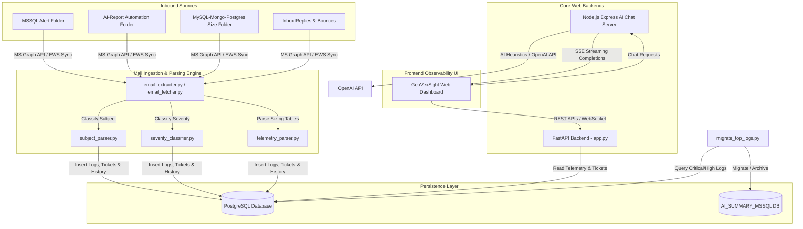

# GeoVexSight Enterprise Observability Platform: System Architecture & Developer Hand-off Manual

This document provides a comprehensive technical overview, architectural mapping, database reference, and setup guide for the **GeoVexSight** enterprise observability platform. It is designed to facilitate a smooth knowledge transfer to the receiving engineering and database operations teams.

---

## 1. System Architecture Overview

GeoVexSight is an enterprise-grade observability dashboard and automation hub designed to ingest, parse, classify, and persist database telemetry and system log files in real time. It automates ticket generation for threshold breaches (resource spikes, offline services, critical database errors) and provides an interactive dashboard with AI-driven root cause diagnostics.



### Core Architecture Components

1. **FastAPI Web Backend (`app.py`)**: A high-performance Python REST API serving as the administrative engine, managing endpoints for telemetry logs, user authentication, ticket statuses, comments, and config parameters.
2. **Background Worker Daemons**:
   - **Mail Synchronizer (`email_extracter.py`)**: Spawns as a background thread on startup. Queries Exchange/Microsoft Graph API on an hourly schedule to sync emails, parse log messages, identify duplicates, and execute ticketing actions.
   - **Resource & Threshold Checker (`app.py / AlertSettingsDaemon`)**: Runs every 5 minutes in a background thread to check for resource spikes, offline servers, and critical log errors, triggering automated HTML email dispatches and new incident tickets.
   - **Critical Log Archiver (`migrate_top_logs.py`)**: Runs continuously, polling the primary database every hour for `Critical` or `High` severity MSSQL error logs and migrating them to a dedicated archive database (`AI_SUMMARY_MSSQL`) for offline LLM parsing and auditing.
3. **Database Persistence Layer (PostgreSQL)**: Serves as the centralized storage engine for log entries, server utilization history, ticketing data, client mappings, configurations, and sync watermarks.
4. **Node.js Express AI Chat Server (`new_features/node_backend/server.js`)**: A separate server interfacing with OpenAI (`gpt-4o-mini`) using Server-Sent Events (SSE) to stream diagnostic instructions and DBA problem-solving steps directly to dashboard users.

---

## 2. Codebase Directory Mapping

The project structure is organized as follows:

```
GeoVexSight-App-main/
│
├── app.py                      # Main FastAPI application, routing, and daemon initialization
├── config.py                   # Environment variable loader
├── db_manager.py               # Database connection manager (wraps migrations.py)
├── email_extracter.py          # Primary Exchange/Graph mailbox ingestion engine
├── email_fetcher.py            # Diagnostic/telemetry database incremental sync runner
├── severity_classifier.py      # Severity evaluator mapping log messages to Critical/High/Medium/Low
├── subject_parser.py           # Standardized regex subject classifier (resolves client/server/type)
├── migrate_top_logs.py         # Background critical log migrator/archiver daemon
├── cache_utils.py              # LRU memory cache management
├── log_utils.py                # System audit and error logging engine
│
├── new_features/
│   ├── backend/
│   │   ├── migrations.py       # Core PostgreSQL database schema initialization & migrations
│   │   ├── routes.py           # Administrative endpoints, tickets, permissions, & reports
│   │   ├── telemetry_parser.py # DB/Table size HTML parser, comparison, and alert engine
│   │   └── utilization_sync.py # Server resource history ingestion sync helpers
│   │
│   └── node_backend/
│       ├── package.json        # Node.js dependencies (express, cors, openai, dotenv)
│       └── server.js           # Express server for streaming AI diagnostics (SSE)
│
├── frontend_build/             # Compiled static frontend dashboard assets (HTML, CSS, JS)
├── logs/
│   └── folder_watermarks.json  # File-based sync watermarks for Graph API mail folders
└── docker-compose.yml          # Container configuration for local PostgreSQL service
```

---

## 3. Database Schema Reference

The database structure is initialized automatically on startup via `migrations.py`. Below are the primary tables driving the platform's core operations:

### Telemetry Logs & Archiving
* **`db_monitoring_logs`**: Stores raw telemetry log messages parsed from incoming emails.
  * `log_hash` (`TEXT UNIQUE`): Unique SHA-256 hash identifying duplicate logs in a given time bucket.
  * `severity` (`TEXT`): Categorization (`Critical`, `High`, `Medium`, `Low`, `Unknown`).
  * `occurrence_count` (`INTEGER`): Tracks occurrences of the exact same message within a 1-hour time window.
* **`db_archived_logs`**: Archive table for logs moved out of the active monitoring table.
* **`db_uptime_history`**: Tracks availability status (`ONLINE`, `OFFLINE`, `STOPPED`) of servers and services.

### Incident Management & Ticketing
* **`tickets`**: Tracks system alerts, resource spike summaries, and server downtime incidents.
  * `priority` (`TEXT`): Level of urgency (`Critical`, `High`, `Medium`, `Low`).
  * `status` (`TEXT`): Workflow status (`OPEN`, `ASSIGNED`, `IN_PROGRESS`, `RESOLVED`, `CLOSED`).
  * `business_unit` (`TEXT`): Maps directly to database technology (e.g., `MSSQL`, `MySQL`, `MongoDB`).
* **`ticket_comments`**: Stores conversation threads, system actions, and incoming client/DBA email replies associated with a ticket.
  * `comment_type` (`TEXT`): Categorization (`log`, `dba_reply`, `client_reply`, `comment`).

### Sizing Telemetry
* **`database_size_history`**: Tracks size changes of server databases (e.g., DB size in bytes, free space).
* **`table_size_history`**: Tracks size and row counts of specific tables (e.g., table size in bytes, index size).

### Configuration & Alerts Routing
* **`admin_clients`**: Maps servers to clients, and tracks contact details (client emails, phone numbers).
* **`client_alert_settings`**: Defines threshold overrides for CPU, memory, disk, and I/O utilization per client.
* **`technology_alerts_config`**: Standard fallback recipient email mappings based on database technology.
* **`processed_emails`**: Deduplication table tracking Microsoft Graph/EWS message IDs to prevent double-processing.

---

## 4. Automated Alert & Telemetry Ingestion Pipeline

GeoVexSight processes incoming alerts through a multi-stage pipeline designed to ingest, parser-route, deduplicate, write to the database, perform Root Cause Analysis (RCA), and alert engineers.

```
       [ Incoming Email ]
               │
               ▼
   [ Incremental Sync check ] ──(Duplicate Message ID?)──► [ Skip & Mark Read ]
               │ (No)
               ▼
      [ subject_parser.py ] ──► Extracts: Client, Server, DB Type, Alert Type
               │
               ▼
   [ severity_classifier.py ] ──► Evaluates Severity (Critical, High, Medium, Low)
               │
               ▼
       [ Ingestion Logic ]
        ├── MSSQL Alert Folder ──────► Deduplicates Ticket ──► Creates Ticket & Sends HTML Alert
        ├── Size Telemetry Folder ───► database_size_history / table_size_history ──► Growth Alert
        └── Inbox Folder (Replies) ──► Maps Subject/Body to Ticket ID ──► Appends comment
```

### Stage 1: Incremental Folder Ingestion
* The `MailReaderDaemon` runs hourly, fetching only emails received after the watermark saved in `logs/folder_watermarks.json` or the max timestamp in the `processed_emails` database.
* Emails are processed sequentially across four folders:
  1. **`MSSQL Alert`**: Alerts originating from database agents.
  2. **`Ai-report-automation`**: General system log analytics.
  3. **`MySQL-Mongo-Postgres-DB`**: Sizing telemetry files.
  4. **`Inbox`**: General inbox and email replies.

### Stage 2: Subject Parsing & Normalization (`subject_parser.py`)
Subject parsing uses regular expressions to categorize emails:
* **Azure Alerts**: Extracts severity, metric name, and matches server names to map the client.
* **Job Failures**: Parses client, server, job status, and state transitions (e.g., `Failed Alert -> Open`).
* **Long Running Queries**: Extracts client, server, alert state, and query details.

### Stage 3: Severity Classification Heuristics (`severity_classifier.py`)
Logs are scanned for metric values first, falling back to database-specific keyword matches:
* **Metrics Ingestion**: Parses JSON payloads for values (e.g., `"cpu_percent": 91.24` or `"usage_percent": 47.4`).
  * **CPU**: Critical > 90%, High > 75%, Medium > 60%.
  * **Memory/Disk/IO**: Critical > 90%, High > 80%, Medium > 70%.
* **Keyword Matching**: Checks for critical indicators (e.g., `disk full`, `out of memory`, `replication stopped`, `Page Verification Failed`).

### Stage 4: Ticket Automation, RCA Heuristics, & Alerting
1. **Deduplication Check**: Before raising a ticket, the engine queries the database to ensure no ticket with the same subject has been created for the client on the current day.
2. **Incident Creation**: Generates a ticket in the `tickets` table with appropriate severity levels.
3. **RCA Analysis**: Scans database tables (`diagnosticdata_long_queries`, `diagnosticdata_error_logs`, `diagnosticdata_blocking`) within a +/- 1-hour window around the spike peak. Isolates suspect queries (e.g., query with highest CPU time or logical reads) and inserts this data directly into the ticket description and HTML alert body.
4. **Alert Dispatch**: Dispatches a highly styled HTML email to the client's configured email and the database technology support email. The email subject line is standardized with a `[Ticket #{ID}]` prefix to enable automated threading.
5. **Reply Threading**: If a user replies to an alert, the engine extracts the `[Ticket #{ID}]` marker, sanitizes the email signature/history, logs the reply in the `ticket_comments` table, and toggles the ticket status to `OPEN` if it was resolved or closed.

---

## 5. Sizing Telemetry Ingestion & Growth Alerts

Database and table sizing telemetry emails containing HTML-formatted report tables are processed through `telemetry_parser.py`:

1. **Size Conversion**: Sizes are normalized to bytes (handling dynamic inputs like `GB`, `MB`, `KB`).
2. **Persistence**: Saves records to `database_size_history` and `table_size_history`.
3. **Historic Comparison**: Evaluates sizing against previous entries:
   * Compares the database size with the last entry captured.
   * If database growth exceeds defined limits, it records the size difference.
4. **Growth Alerting**: Triggers a consolidated ticketing workflow, opening a Ticket and notifying the configured DBAs and clients with a summary detailing the exact database and table-level size variations.

---

## 6. System Configuration Guide (`.env` File Template)

Configure the application by creating a `.env` file in the root directory:

```env
# Database Settings
DB_HOST=localhost
DB_NAME=Incoming-error-data
DB_USER=postgres
DB_PASSWORD=y7UMhWmLcqSJzmhTGDyK
DB_PORT=5432

# FastAPI Server Port & Environment
PORT=8000
APP_REDIRECT_URI=https://api.geovexsight.geopits.com/callback

# Microsoft EWS / Graph API OAuth Credentials
USER_EMAIL=dccagent@geopits.com
MAIL_PASSWORD=your_mail_password_here
APP_CLIENT=your_azure_client_id_here
APP_SECRET=your_azure_client_secret_here
APP_TENANT=your_azure_tenant_id_here

# OpenAI Integration (Required for AI Chatbot and Diagnostics)
OPENAI_API_KEY=your_openai_api_key_here
```

---

## 7. Environments Setup & Running Guide

### A. Local Development (Docker Compose)

For local development, PostgreSQL is containerized. 

1. **Start the database container**:
   ```bash
   docker-compose up -d
   ```
2. **Install dependencies**:
   ```bash
   pip install -r requirements.txt
   ```
3. **Run the FastAPI server**:
   ```bash
   uvicorn app:app --host 0.0.0.0 --port 8000 --reload
   ```
4. **Start the Node.js Chat Server**:
   ```bash
   cd new_features/node_backend
   npm install
   node server.js
   ```

### B. Windows Production Startup

Use the provided batch scripts to manage the lifecycle of background processes:

* **Start Web Server & Daemons**: Double-click `start_server.bat` to launch the FastAPI server, initialization migrations, and background loops.
* **Start Mail Sync Daemon**: Run `start_mail_monitor.bat` to execute `email_extracter.py` independently.
* **Graceful Restart**: Run `restart_server.bat` to terminate active Uvicorn bindings and relaunch the daemon thread.

### C. Linux Production Deployment (Systemd Services)

For staging/production environments on Linux, manage services via Systemd configurations.

#### 1. Backend Service Configuration (`/etc/systemd/system/geovexsight.service`)
```ini
[Unit]
Description=GeoVexSight FastAPI Backend Application
After=network.target postgresql.service

[Service]
User=root
WorkingDirectory=/Users/sanjay/Documents/GeoVexSight-App-main 2
EnvironmentFile=/Users/sanjay/Documents/GeoVexSight-App-main 2/.env
ExecStart=/usr/local/bin/uvicorn app:app --host 0.0.0.0 --port 8000 --workers 4
Restart=always
RestartSec=5

[Install]
WantedBy=multi-user.target
```

#### 2. Log Migrator Service Configuration (`/etc/systemd/system/geovexsight-migrator.service`)
```ini
[Unit]
Description=GeoVexSight Critical Log Migrator Daemon
After=network.target

[Service]
User=root
WorkingDirectory=/Users/sanjay/Documents/GeoVexSight-App-main 2
EnvironmentFile=/Users/sanjay/Documents/GeoVexSight-App-main 2/.env
ExecStart=/usr/bin/python3 migrate_top_logs.py
Restart=always
RestartSec=10

[Install]
WantedBy=multi-user.target
```

#### 3. AI Chat Service Configuration (`/etc/systemd/system/geovexsight-chat.service`)
```ini
[Unit]
Description=GeoVexSight Node.js AI Chatbot Backend
After=network.target

[Service]
User=root
WorkingDirectory=/Users/sanjay/Documents/GeoVexSight-App-main 2/new_features/node_backend
EnvironmentFile=/Users/sanjay/Documents/GeoVexSight-App-main 2/.env
ExecStart=/usr/bin/node server.js
Restart=always
RestartSec=5

[Install]
WantedBy=multi-user.target
```

#### 4. Service Commands Checklist
```bash
# Reload systemd configuration
systemctl daemon-reload

# Start services
systemctl start geovexsight geovexsight-migrator geovexsight-chat

# Enable services to run on boot
systemctl enable geovexsight geovexsight-migrator geovexsight-chat

# Check service status
systemctl status geovexsight
```

---

## 8. Common Troubleshooting Guidelines

> [!IMPORTANT]
> **Database Migrations and Schema Updates**  
> If any database tables are added or modified, make sure to add the SQL statements to the table migration schema in `/new_features/backend/migrations.py`. Run `python new_features/backend/migrations.py` to test execution before launching the main server.

> [!WARNING]
> **Microsoft OAuth Token Expiration Issues**  
> In production, EWS/MS Graph OAuth tokens may expire or invalidate. The mail sync loop tracks warning responses (e.g., `refresh_token`, `aadsts`, `expired`). In the event of a token failure, the daemon triggers `Protocol.clear_cache()` and attempts a reconnect using Azure app registrations credentials. Ensure the Azure Redirect URI matches the `APP_REDIRECT_URI` configuration in the `.env` file.

> [!NOTE]
> **Port Conflicts on Startup**  
> If Uvicorn fails to bind to port `8000`, locate and terminate any hanging processes using:
> * **Linux/macOS**: `lsof -i :8000` followed by `kill -9 <PID>`
> * **Windows**: `netstat -ano | findstr :8000` followed by `taskkill /PID <PID> /F`
