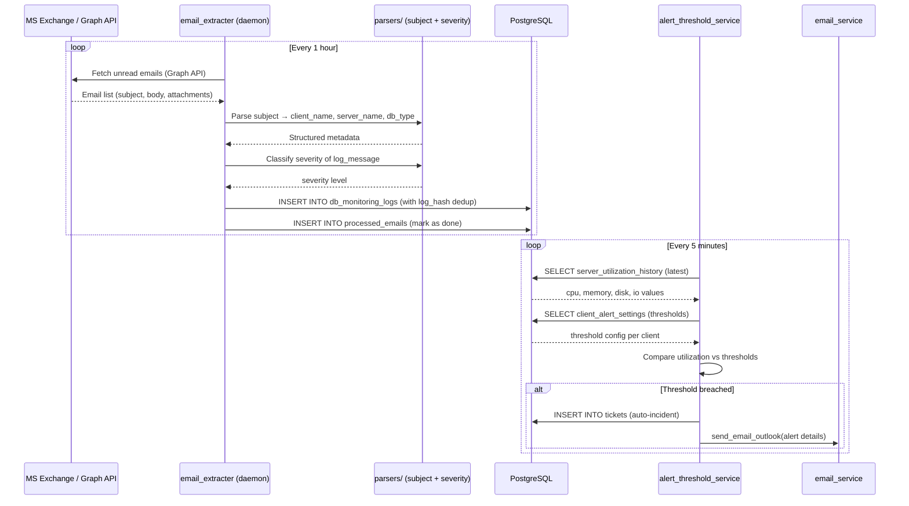
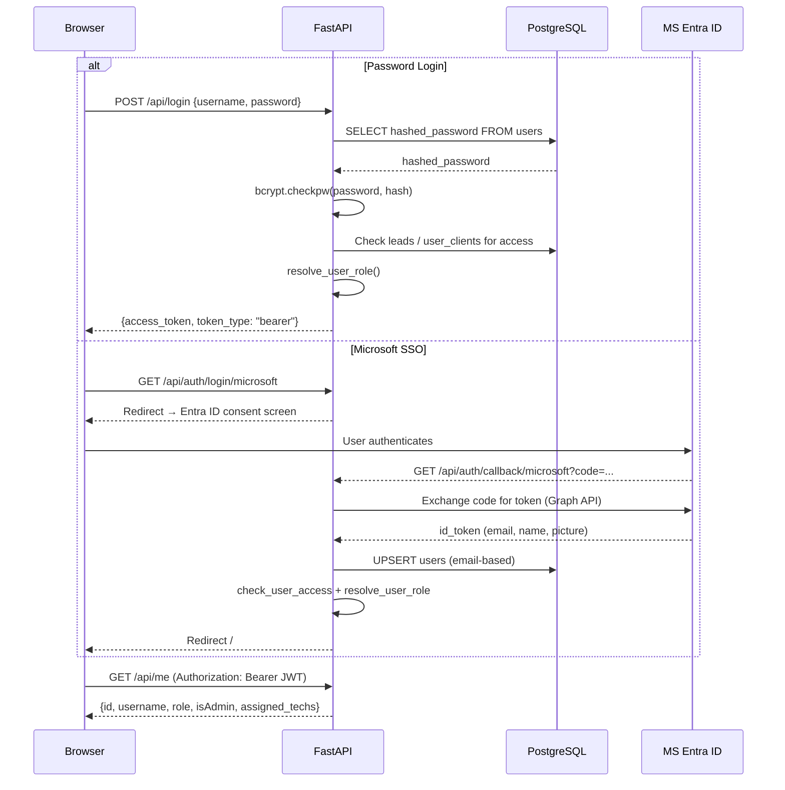
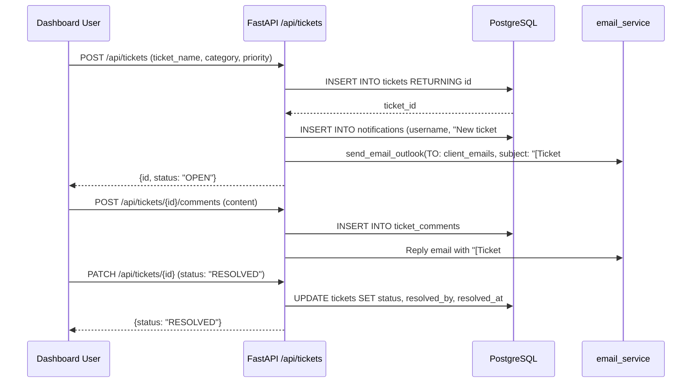
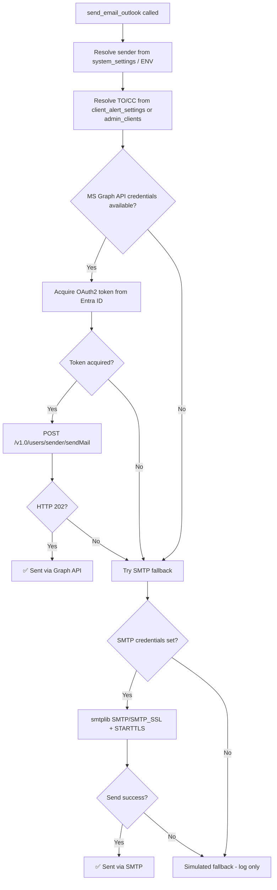

# GeoMon — Full Project Documentation

## 1. System Overview

GeoMon is an enterprise database observability and incident management platform built by GeoPITS. It ingests telemetry data (logs, server metrics, uptime reports) via email, exposes a FastAPI backend, and serves a React 18 SPA frontend. Alerts are auto-dispatched via Microsoft Graph API / SMTP when thresholds are breached.

---

## 2. ER Diagram

```mermaid
erDiagram
    users {
        serial id PK
        varchar username
        varchar hashed_password
        varchar role
        varchar full_name
        varchar email
        text profile_pic
        timestamptz last_active_at
    }
    user_clients {
        serial id PK
        integer user_id FK
        integer client_id FK
        varchar access_level
        timestamp created_at
    }
    user_page_activity {
        serial id PK
        text username
        text page_path
        integer duration_seconds
        timestamp last_active_at
    }
    online_users {
        serial id PK
        text username
        text units
        timestamp created_at
    }
    tickets {
        serial id PK
        text business_unit
        text company
        text contact
        text ticket_name
        text category
        text status
        text priority
        text agent
        text description
        text created_by
        timestamp created_at
        text resolved_by
        timestamp resolved_at
    }
    ticket_comments {
        serial id PK
        integer ticket_id FK
        text author
        text comment_type
        text content
        text attachments
        timestamp created_at
    }
    ticket_business_units {
        serial id PK
        text name
    }
    admin_clients {
        serial id PK
        text client_name
        text db_type
        text server_name
        text client_email
        text phone_number
        timestamp created_at
    }
    client_access {
        serial id PK
        varchar client_email
        varchar technology
        varchar client_name
        varchar server_name
        varchar status
        varchar phone_number
        timestamp created_at
    }
    client_alert_settings {
        serial id PK
        varchar client_name
        varchar db_type
        numeric cpu_threshold
        numeric memory_threshold
        numeric disk_threshold
        numeric io_threshold
        integer slow_query_threshold_ms
        integer long_running_threshold_sec
        text client_emails
        text cc_emails
        boolean server_down_alert
        boolean critical_error_alert
        timestamp last_summary_sent
    }
    technology_alerts_config {
        varchar technology PK
        varchar alert_email
        timestamp created_at
    }
    db_monitoring_logs {
        bigserial id PK
        text client_name
        text server_name
        text db_type
        text log_type
        text log_source
        timestamp log_time
        timestamp log_time_utc
        timestamp log_time_ist
        text log_level
        text log_message
        integer occurrence_count
        jsonb raw_log
        text email_subject
        timestamp email_received_time
        text log_hash
        varchar severity
        varchar status
        varchar owner
        varchar client_visibility
        varchar ticket_status
        text next_action
        boolean is_archived
        boolean is_semantic
        integer semantic_count
        text semantic_hash
        text time_bucket
        integer ticket_id
        timestamptz status_updated_at
        timestamp created_at
    }
    db_uptime_history {
        serial id PK
        varchar client_name
        varchar server_name
        varchar db_type
        varchar service_name
        varchar status
        varchar uptime_desc
        timestamp last_restart_time
        timestamp captured_at
    }
    database_size_history {
        serial id PK
        varchar server_name
        varchar database_name
        bigint total_size_bytes
        date captured_date
        varchar db_type
    }
    table_size_history {
        serial id PK
        varchar server_name
        varchar database_name
        varchar table_name
        bigint size_bytes
        date captured_date
        varchar db_type
    }
    server_utilization_history {
        serial id PK
        varchar server_name
        numeric cpu_utilization
        numeric memory_utilization
        numeric disk_utilization
        numeric io_utilization
        numeric read_iops
        numeric write_iops
        timestamp captured_at
    }
    processed_emails {
        varchar message_id PK
        varchar subject
        varchar sender
        timestamp processed_at
        timestamp received_at
    }
    telemetry_records {
        serial id PK
        varchar report_type
        varchar client_name
        varchar server_name
        timestamp captured_at
        jsonb raw_data
        varchar log_hash
        timestamp created_at
    }
    client_reports {
        serial id PK
        text client_name
        text title
        text month
        text year
        text file_name
        text file_data
        text notes
        text uploaded_by
        timestamp uploaded_at
    }
    report_reviews {
        serial id PK
        integer report_id FK
        text username
        integer rating
        text comment
        text mom
        timestamp created_at
    }
    report_sharing_history {
        serial id PK
        integer report_id FK
        text report_title
        text shared_by
        text share_platform
        text recipient
        timestamp created_at
    }
    feedbacks {
        serial id PK
        text username
        text email
        text feedback_text
        integer rating
        timestamp created_at
    }
    share_history {
        serial id PK
        text username
        text platform
        text content_type
        text client_name
        text server_name
        text log_message
        text notes
        varchar status
        varchar owner
        text db_type
        timestamp shared_at
    }
    system_settings {
        text key PK
        text value
    }
    leads {
        serial id PK
        varchar email
        varchar technology
        boolean is_lead
        varchar status
    }
    notifications {
        serial id PK
        text username
        text message
        boolean is_read
        timestamp created_at
    }
    admin_agents {
        serial id PK
        text agent_name
        text company_name
        text business_unit
        text technology
        text email
        timestamp created_at
    }

    users ||--o{ user_clients : "has"
    users ||--o{ user_page_activity : "tracks"
    admin_clients ||--o{ user_clients : "assigned_to"
    tickets ||--o{ ticket_comments : "has"
    client_reports ||--o{ report_reviews : "reviewed_by"
    client_reports ||--o{ report_sharing_history : "shared_via"
    db_monitoring_logs }o--o| tickets : "linked_ticket"
```



---

## 3. Database Schema Groups

| Group | Tables |
|---|---|
| **Auth & Users** | `users`, `user_clients`, `user_page_activity`, `online_users` |
| **Incident Management** | `tickets`, `ticket_comments`, `ticket_business_units` |
| **Client Config** | `admin_clients`, `client_access`, `client_alert_settings`, `technology_alerts_config` |
| **Telemetry & Logs** | `db_monitoring_logs`, `db_uptime_history`, `database_size_history`, `table_size_history`, `server_utilization_history`, `telemetry_records` |
| **Ingestion Control** | `processed_emails` |
| **Reports & Feedback** | `client_reports`, `report_reviews`, `report_sharing_history`, `feedbacks` |
| **System** | `system_settings`, `leads`, `notifications`, `admin_agents`, `share_history` |

### Views
- **`db_archived_logs`** — Updatable view over `db_monitoring_logs WHERE is_archived = TRUE`  
  Has `INSERT / UPDATE / DELETE` rewrite rules for bidirectional sync.

### Materialized Views
- **`combined_logs_mv`** — Pre-aggregated log view for dashboard performance (refreshed concurrently via background thread).

---

## 4. Backend Architecture

### 4.1 Entry Point — `backend/app.py`

```
FastAPI app
  │
  ├── Middleware Stack (in order)
  │     ├── GZipMiddleware          (compress responses ≥ 1 KB)
  │     ├── SessionMiddleware        (OAuth2 state cookie, 5 min TTL)
  │     └── NetworkRestrictionMiddleware  (IP allowlist check)
  │
  ├── Startup Daemons (daemon threads, auto-start)
  │     ├── MailReaderDaemon         → services/email_extracter.py  (1-hr sweep)
  │     ├── AlertSettingsDaemon      → services/alert_threshold_service.py
  │     └── DbMaintenanceCleanup     → services/cleanup_processed_emails.py
  │
  ├── Routers
  │     ├── routes.router            (legacy /api/* routes)
  │     └── api_router               (modular /api/* routers)
  │
  └── Static file serving           (React SPA build → /static)
```

### 4.2 `core/` — Shared Infrastructure

| Module | Purpose |
|---|---|
| `config.py` | All env-vars resolved here — single source of truth |
| `database.py` | `ThreadedConnectionPool` (2–20 conns) + `get_db()` context manager |
| `dao.py` | Centralized DAO — CRUD for users, tickets, clients |
| `security.py` | `bcrypt` password hashing + `jose` JWT encode/decode |
| `deps.py` | FastAPI `Depends()` injectors for auth |

### 4.3 `services/` — Background Daemons

| Service | Role |
|---|---|
| `email_extracter.py` | Polls Exchange/Graph for inbound emails, parses into `db_monitoring_logs` |
| `email_fetcher.py` | Microsoft Graph API email fetcher utility |
| `email_service.py` | Outbound dispatch: Graph API → SMTP → Simulated fallback |
| `alert_threshold_service.py` | Checks CPU/Mem/Disk/IO per-client thresholds, fires alert emails |
| `utilization_sync.py` | Syncs server utilization data into `server_utilization_history` |
| `sync_service.py` | Log record sync helper |
| `cleanup_processed_emails.py` | Purges `processed_emails` rows older than 30 days |

### 4.4 `parsers/` — Data Transformation

| Parser | Role |
|---|---|
| `subject_parser.py` | Parses email subject lines to extract `client_name`, `server_name`, `db_type` |
| `severity_classifier.py` | Classifies log messages into severity levels (Critical / High / Medium / Low) |
| `json_parser.py` | Parses raw JSON telemetry payloads from email bodies |

---

## 5. Frontend Architecture

### 5.1 Router Map

```
/ (HashRouter)
├── /login                         → Login.jsx (password + MS SSO)
├── / (protected)                  → Home.jsx (primary dashboard)
├── /tickets (protected)           → TicketsHub.jsx
├── /reports (protected)           → ReportsHub.jsx
├── /admin/setup (protected)       → AdminSetup.jsx
├── /servers (protected)           → ServerGridPage.jsx
├── /telemetry-clients (protected) → TelemetryClients.jsx
│   ├── /telemetry-client-details/:name
│   ├── /telemetry-client-databases/:name
│   ├── /telemetry-client-tables/:name
│   └── /telemetry-client-uptime/:name
├── /dashboard (protected)         → Dashboard.jsx (classic)
├── /lead (protected)              → LeadDashboard.jsx
├── /log-status (protected)        → LogStatusPage.jsx
├── /observability (protected)     → ObservabilityDashboard.jsx
└── /reports/upload|download       → ReportUpload / ReportDownload
```

### 5.2 Global State

| Context | Purpose |
|---|---|
| `AuthContext` | Stores JWT token, user profile, polls `/api/me` on mount |
| `ThemeContext` | Light / dark theme toggle |

### 5.3 Code Splitting
All pages are **lazy-loaded** via `React.lazy()` + `<Suspense>` with a premium animated loader, ensuring minimal initial bundle size.

---

## 6. Data Flow Diagrams

### 6.1 Email Ingestion → Log Storage



### 6.2 User Login Flow



### 6.3 Ticket Lifecycle



### 6.4 Outbound Email Dispatch (email_service.py)



---

## 7. Security Model

| Layer | Implementation |
|---|---|
| **Authentication** | JWT (HS256, 7-day expiry) or Microsoft Entra ID OAuth2 |
| **Password Storage** | bcrypt with salt rounds |
| **Network Restriction** | IP allowlist middleware — loopback + private IPs always pass |
| **Role Resolution** | Dynamic: checks `users.role`, `leads` table, `user_clients` at every request |
| **CORS** | `allow_origins=["*"]` (internal network enforced at IP layer) |
| **Session** | `SessionMiddleware` (5-min TTL, SameSite=None, HTTPS-only for OAuth state) |

---

## 8. API Reference Summary

### Authentication
| Method | Endpoint | Description |
|---|---|---|
| POST | `/api/login` | Password login → JWT |
| GET | `/api/auth/login/microsoft` | SSO redirect |
| GET | `/api/auth/callback/microsoft` | SSO callback |
| GET | `/api/me` | Current user info |

### Logs
| Method | Endpoint | Description |
|---|---|---|
| GET | `/api/logs` | Paginated log list (filtered by role) |
| GET | `/api/logs/archived` | Archived logs |
| POST | `/api/logs/bulk-archive` | Archive multiple logs |
| GET | `/api/logs/metadata` | Log filter metadata |

### Tickets
| Method | Endpoint | Description |
|---|---|---|
| GET | `/api/tickets` | List tickets (paginated) |
| POST | `/api/tickets` | Create ticket |
| GET | `/api/tickets/{id}` | Get ticket details |
| PATCH | `/api/tickets/{id}` | Update ticket |
| DELETE | `/api/tickets/{id}` | Delete ticket |
| POST | `/api/tickets/{id}/comments` | Add comment |

### Telemetry
| Method | Endpoint | Description |
|---|---|---|
| GET | `/api/telemetry/utilization` | Server utilization history |
| GET | `/api/telemetry/uptime` | DB uptime history |
| GET | `/api/telemetry/db-sizes` | Database size history |
| GET | `/api/telemetry/table-sizes` | Table size history |
| POST | `/api/telemetry/ingest` | Ingest telemetry records |

### Users / Clients / Reports
| Method | Endpoint | Description |
|---|---|---|
| GET | `/api/users` | List users (admin only) |
| POST | `/api/users` | Create user |
| GET | `/api/clients` | List clients |
| POST | `/api/clients` | Create client |
| GET | `/api/reports` | List reports |
| POST | `/api/reports/upload` | Upload report |

---

## 9. Background Daemons

| Daemon Thread Name | Module | Interval | Function |
|---|---|---|---|
| `MailReaderDaemon` | `services/email_extracter.py` | Every 1 hour | Reads inbound Exchange/Graph emails, parses logs |
| `AlertSettingsDaemon` | `services/alert_threshold_service.py` | Every 5 min | Checks utilization thresholds, fires alerts |
| `DbMaintenanceCleanup` | `services/cleanup_processed_emails.py` | Once at startup | Purges old processed_emails rows |

---

## 10. Deployment

### Linux (Production — systemd)
```bash
./geomon.sh start    # starts uvicorn on port 8000
./geomon.sh stop     # stops service
./geomon.sh restart  # restarts service
./geomon.sh status   # shows service status
```

### Windows
```bat
start_server.bat       # starts backend + frontend dev server
restart_server.bat     # restarts backend
start_mail_monitor.bat # starts email monitoring daemon
```

### Docker (Database only)
```bash
docker compose up -d    # starts PostgreSQL 17 on localhost:5432
docker compose down     # stops containers
```

### Frontend Build
```bash
cd frontend
npm run build   # outputs to frontend/dist
# Copy dist/ to backend/static/ for FastAPI to serve
cp -r dist/* ../backend/static/
```

---

## 11. Environment Variables Reference

| Variable | Required | Default | Description |
|---|---|---|---|
| `DB_HOST` | ✅ | `localhost` | PostgreSQL host |
| `DB_PORT` | ✅ | `5432` | PostgreSQL port |
| `DB_NAME` | ✅ | `geomon` | Database name |
| `DB_USER` | ✅ | `postgres` | DB user |
| `DB_PASSWORD` | ✅ | — | DB password |
| `JWT_SECRET` | ✅ | — | JWT signing secret |
| `APP_CLIENT` | ☑️ | — | Azure App Client ID (SSO + Graph API) |
| `APP_SECRET` | ☑️ | — | Azure App Client Secret |
| `APP_TENANT` | ☑️ | — | Azure Tenant ID |
| `APP_REDIRECT_URI` | ☑️ | — | OAuth2 callback URL |
| `USER_EMAIL` | ☑️ | — | Sender email address |
| `MAIL_PASSWORD` | ☑️ | — | SMTP/Exchange password |
| `OPENAI_API_KEY` | ☑️ | — | OpenAI API key for chatbot |
| `ALLOWED_IP_NETWORKS` | ❌ | `127.0.0.1` | Comma-separated CIDRs for IP restriction |
| `ADMIN_EMAILS` | ❌ | — | Comma-separated admin emails |

> ✅ Required &nbsp; ☑️ Required for full functionality &nbsp; ❌ Optional

---

*© 2026 GeoPITS. GeoMon Enterprise Observability Platform. All rights reserved.*
