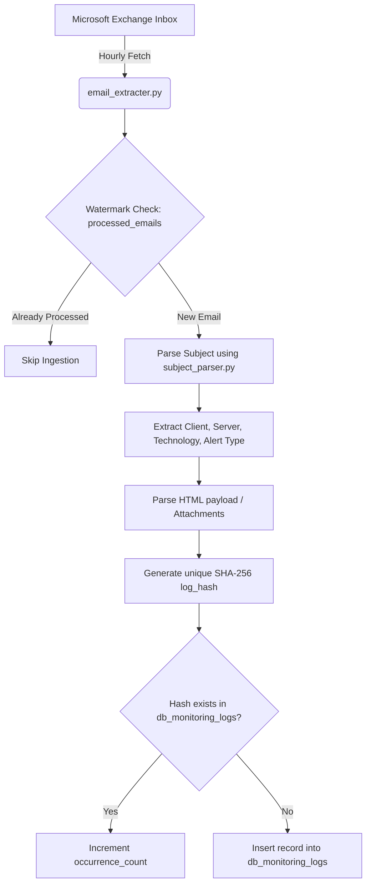
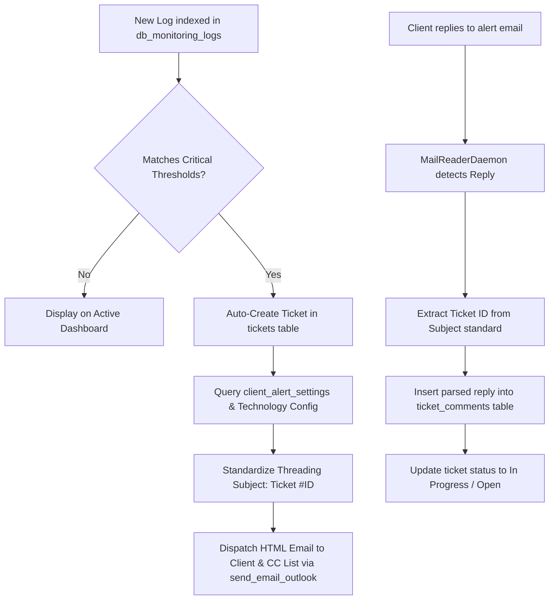

# GeoVexSight Observability Platform: Project Architecture, Schema, and Data Flows

This document provides a comprehensive technical catalog of the **GeoVexSight** enterprise observability platform. It details the system architecture, full PostgreSQL database schema catalog, entity relationships, and core automation pipelines.

---

## 1. System Architecture Overview

GeoVexSight is built upon a decoupled microservices architecture designed to collect, process, index, and visualize massive telemetry logs from enterprise database engines (MSSQL, MySQL, MongoDB, PostgreSQL, etc.).

```
┌────────────────────────────────────────────────────────┐
│                   Data Sources                         │
│  (Database Agents, MSSQL Alerts, Automated Reports)   │
└──────────────────────────┬─────────────────────────────┘
                           │ Outbound Emails / API Push
                           ▼
┌────────────────────────────────────────────────────────┐
│               Ingestion & Parser Daemons               │
│        (email_extracter.py, subject_parser.py)         │
└──────────────────────────┬─────────────────────────────┘
                           │
                           ▼
┌────────────────────────────────────────────────────────┐
│               Database Layer (PostgreSQL)              │
│       (Telemetry, Uptime, Tickets, Utilization)        │
└──────────────────────────┬─────────────────────────────┘
                           │
                           ▼
┌────────────────────────────────────────────────────────┐
│                     FastAPI Backend                    │
│      (Authentication, Admin Workspace, REST APIs)      │
└──────────────────────────┬─────────────────────────────┘
                           │ JWT / HTTP & SSE
                           ▼
┌────────────────────────────────────────────────────────┐
│              React 19 Frontend Dashboard               │
│      (Logs Viewer, Lead Console, Admin Control)        │
└────────────────────────────────────────────────────────┘
```

---

## 2. Full Project Entity Relationship (ER) Diagram

The following Mermaid ER Diagram visualizes the complete database schema of the PostgreSQL instance, covering authentication, tickets, configurations, telemetry history, and sizing details.

```mermaid
erDiagram
    %% Core Authentication & Permissions
    users {
        int id PK
        string username UNIQUE
        string hashed_password
        string full_name
        string email
        string role
        string profile_pic
        timestamp last_active_at
    }
    system_admins {
        string email PK
        string status
    }
    leads {
        int id PK
        string email
        string technology
        boolean is_lead
        string status
    }
    user_page_activity {
        int id PK
        string username
        string page_path
        int duration_seconds
        timestamp last_active_at
    }
    online_users {
        int id PK
        string username UNIQUE
        string units
        timestamp created_at
    }

    %% Incident Management
    tickets {
        int id PK
        string business_unit
        string company
        string contact
        string ticket_name
        string category
        string status
        string priority
        string agent
        string description
        string created_by
        timestamp created_at
        string resolved_by
        timestamp resolved_at
    }
    ticket_comments {
        int id PK
        int ticket_id FK
        string author
        string comment_type
        string content
        string attachments
        timestamp created_at
    }
    ticket_agents {
        int id PK
        string name UNIQUE
    }
    ticket_business_units {
        int id PK
        string name UNIQUE
    }
    notifications {
        int id PK
        string username
        string message
        boolean is_read
        timestamp created_at
    }
    share_history {
        int id PK
        string username
        string notes
        string platform
        string content_type
        string client_name
        string server_name
        string log_message
        string status
        string owner
        string client_visibility
        string ticket_status
        string next_action
        string db_type
        timestamp shared_at
    }

    %% Configuration & Alert Mappings
    admin_clients {
        int id PK
        string client_name
        string db_type
        string server_name
        string client_email
        string phone_number
        timestamp created_at
    }
    client_access {
        int id PK
        string client_email
        string technology
        string client_name
        string server_name
        string status
        string phone_number
        timestamp created_at
    }
    client_alert_settings {
        int id PK
        string client_name
        string db_type
        numeric cpu_threshold
        numeric memory_threshold
        numeric disk_threshold
        numeric io_threshold
        int slow_query_threshold_ms
        int long_running_threshold_sec
        text client_emails
        text cc_emails
        boolean server_down_alert
        boolean critical_error_alert
        timestamp last_summary_sent
        timestamp created_at
    }
    technology_alerts_config {
        string technology PK
        string alert_email
        timestamp created_at
    }
    user_clients {
        int id PK
        int user_id FK
        int client_id FK
        string access_level
        timestamp created_at
    }

    %% Telemetry Logs & Mail Ingestion
    db_monitoring_logs {
        int id PK
        string client_name
        string server_name
        string db_type
        string log_type
        string log_source
        timestamp log_time
        timestamp log_time_utc
        timestamp log_time_ist
        string log_message
        int occurrence_count
        jsonb raw_log
        string email_subject
        timestamp email_received_time
        string log_hash UNIQUE
        timestamp created_at
        string status
        string owner
        string client_visibility
        string ticket_status
        string next_action
        string severity
        timestamp status_updated_at
        int ticket_id FK
    }
    db_archived_logs {
        int id PK
        string client_name
        string server_name
        string db_type
        string log_type
        string log_source
        timestamp log_time
        timestamp log_time_utc
        timestamp log_time_ist
        string log_message
        int occurrence_count
        jsonb raw_log
        string email_subject
        timestamp email_received_time
        string log_hash UNIQUE
        timestamp created_at
        string status
        string owner
        string client_visibility
        string ticket_status
        string next_action
        string severity
        timestamp status_updated_at
        int ticket_id FK
    }
    db_uptime_history {
        int id PK
        string client_name
        string server_name
        string db_type
        string service_name
        string status
        string uptime_desc
        timestamp last_restart_time
        timestamp captured_at
    }
    processed_emails {
        string message_id PK
        string subject
        string sender
        timestamp processed_at
        timestamp received_at
    }

    %% Sizing & Resource Telemetry
    database_size_history {
        int id PK
        string server_name
        string database_name
        bigint total_size_bytes
        date captured_date
    }
    table_size_history {
        int id PK
        string server_name
        string database_name
        string table_name
        bigint size_bytes
        date captured_date
    }
    server_utilization_history {
        int id PK
        string server_name
        numeric cpu_utilization
        numeric memory_utilization
        numeric disk_utilization
        numeric io_utilization
        numeric read_iops
        numeric write_iops
        timestamp captured_at
    }
    client_reports {
        int id PK
        string client_name
        string title
        string month
        string year
        string file_name
        string file_data
        string notes
        string uploaded_by
        timestamp uploaded_at
    }
    report_reviews {
        int id PK
        int report_id FK
        string username
        int rating
        string comment
        timestamp created_at
        string mom
    }
    feedbacks {
        int id PK
        string username
        string email
        string feedback_text
        int rating
        timestamp created_at
    }

    %% Relationships
    users ||--o{ user_clients : "has client permissions"
    admin_clients ||--o{ user_clients : "granted permission"
    tickets ||--o{ ticket_comments : "has replies/comments"
    tickets ||--o{ db_monitoring_logs : "referenced in active logs"
    tickets ||--o{ db_archived_logs : "referenced in archived logs"
    client_reports ||--o{ report_reviews : "has feedback reviews"
```

---

## 3. Database Schema Catalog

### Group A: Authentication, Auditing & User Tracking

#### Table: `users`
Tracks registered specialists, Leads, and clients in the system.
* `id` (`INT PRIMARY KEY SERIAL`): Unique user identifier.
* `username` (`VARCHAR(255) UNIQUE`): Authentication username.
* `hashed_password` (`VARCHAR(255)`): Securely hashed credentials.
* `full_name` (`VARCHAR(255)`): Full display name.
* `email` (`VARCHAR(255)`): Primary email for notifications.
* `role` (`VARCHAR(50)`): Authorization group (`admin`, `lead`, `user`).
* `profile_pic` (`TEXT`): Selected avatar image URL.
* `last_active_at` (`TIMESTAMP`): Latest timestamp of active session.

#### Table: `system_admins`
Hardcoded administrative whitelist.
* `email` (`VARCHAR(255) PRIMARY KEY`): Admin whitelist email.
* `status` (`VARCHAR(50)`): Active/disabled status indicator.

#### Table: `leads`
Determines which users serve as Technology Leads.
* `id` (`INT PRIMARY KEY SERIAL`): Lead record ID.
* `email` (`VARCHAR(255)`): Lead contact email.
* `technology` (`VARCHAR(100)`): Mapped technology (e.g. `MSSQL`, `MySQL`).
* `is_lead` (`BOOLEAN DEFAULT TRUE`): Flags active lead role.
* `status` (`VARCHAR(50) DEFAULT 'active'`): Status state.

#### Table: `user_page_activity` (Audit Logs)
Stores exact page duration metrics of users for auditing.
* `id` (`INT PRIMARY KEY SERIAL`): Audit log identifier.
* `username` (`VARCHAR(255)`): Active auditor username.
* `page_path` (`VARCHAR(255)`): Route visited (e.g. `/admin`, `/`).
* `duration_seconds` (`INT`): Active time spent in seconds.
* `last_active_at` (`TIMESTAMP`): Time of last activity update.

#### Table: `online_users`
Tracks live session heartbeats.
* `id` (`INT PRIMARY KEY SERIAL`): Record identifier.
* `username` (`VARCHAR(255) UNIQUE`): Session owner.
* `units` (`VARCHAR(255)`): Browser client metadata.
* `created_at` (`TIMESTAMP`): Time of connection.

---

### Group B: Ingested Telemetry Logs & Watermarks

#### Table: `db_monitoring_logs`
Holds incoming database logs parsed by the email ingestion engine.
* `id` (`INT PRIMARY KEY SERIAL`): Log record identifier.
* `client_name` (`VARCHAR(255)`): Client tag.
* `server_name` (`VARCHAR(255)`): Server identifier.
* `db_type` (`VARCHAR(50)`): Database technology type (e.g. `MSSQL`).
* `log_type` (`VARCHAR(100)`): Category (e.g. `error_log`, `agent_log`).
* `log_source` (`VARCHAR(255)`): Origin header or service.
* `log_time` (`TIMESTAMP`): Captured time.
* `log_time_ist` (`TIMESTAMP`): Local IST time.
* `log_message` (`TEXT`): Captured log body/details.
* `occurrence_count` (`INT DEFAULT 1`): Dynamic counter for duplicates.
* `log_hash` (`VARCHAR(255) UNIQUE`): SHA-256 hash (deduplicates within same hour).
* `status` (`VARCHAR(50) DEFAULT 'Open'`): Audit status (`Open`, `Under Review`, `Resolved`, `Ignored`).
* `owner` (`VARCHAR(255) DEFAULT 'None'`): Mapped specialist.
* `client_visibility` (`VARCHAR(100) DEFAULT 'None'`): Visibility policy.
* `ticket_status` (`VARCHAR(100) DEFAULT 'None'`): Mapped ticket reference status.
* `severity` (`VARCHAR(50)`): Computed severity level (`Critical`, `High`, `Medium`, `Low`).

#### Table: `db_archived_logs`
Archive table sharing the same schema as `db_monitoring_logs` for historical records.

#### Table: `processed_emails`
Maintains watermarks of ingested emails to prevent double-processing.
* `message_id` (`VARCHAR(255) PRIMARY KEY`): Unique Exchange/Graph API message ID.
* `subject` (`TEXT`): Email subject string.
* `sender` (`VARCHAR(255)`): Sender email address.
* `processed_at` (`TIMESTAMP DEFAULT CURRENT_TIMESTAMP`): Ingestion time.
* `received_at` (`TIMESTAMP`): Time received by mail server.

---

### Group C: Alert Mappings, Configuration, and Clients

#### Table: `admin_clients`
Stores clients and database servers registered by administrators.
* `id` (`INT PRIMARY KEY SERIAL`): Client record identifier.
* `client_name` (`VARCHAR(255)`): Name of the client company.
* `db_type` (`VARCHAR(100)`): Mapped technology (e.g. `MSSQL`).
* `server_name` (`VARCHAR(255)`): Server host name/IP.
* `client_email` (`TEXT`): Comma-separated client contact emails.
* `phone_number` (`VARCHAR(50)`): Contact phone number.

#### Table: `user_clients`
Binds users to specific clients, restricting visible clients for non-admins.
* `id` (`INT PRIMARY KEY SERIAL`): Privilege record ID.
* `user_id` (`INT REFERENCES users(id)`): Authorized user.
* `client_id` (`INT REFERENCES admin_clients(id)`): Mapped client.
* `access_level` (`VARCHAR(50)`): Level of visibility.

#### Table: `client_alert_settings`
Specifies utilization thresholds for triggers.
* `id` (`INT PRIMARY KEY SERIAL`): Configuration identifier.
* `client_name` (`VARCHAR(255)`): Associated client.
* `db_type` (`VARCHAR(100)`): Database type.
* `cpu_threshold` (`NUMERIC`): Max CPU utilization % before alerting.
* `memory_threshold` (`NUMERIC`): Max memory utilization %.
* `disk_threshold` (`NUMERIC`): Max disk space utilization %.
* `slow_query_threshold_ms` (`INT`): Query time threshold.
* `long_running_threshold_sec` (`INT`): Transaction time threshold.
* `client_emails` (`TEXT`): Targeted recipients.
* `cc_emails` (`TEXT`): CC'ed emails.

---

### Group D: Sizing, Resource Utilization, and Reports

#### Table: `database_size_history`
Tracks database file sizes daily.
* `id` (`INT PRIMARY KEY SERIAL`): Sizing record ID.
* `server_name` (`VARCHAR(255)`): Host server.
* `database_name` (`VARCHAR(255)`): Target database.
* `total_size_bytes` (`BIGINT`): Calculated size in bytes.
* `captured_date` (`DATE`): Date of collection.

#### Table: `table_size_history`
Tracks physical table sizes daily.
* `id` (`INT PRIMARY KEY SERIAL`): Table size ID.
* `server_name` (`VARCHAR(255)`): Host server.
* `database_name` (`VARCHAR(255)`): Mapped database.
* `table_name` (`VARCHAR(255)`): Table identifier.
* `size_bytes` (`BIGINT`): Calculated size in bytes.
* `captured_date` (`DATE`): Collection date.

#### Table: `server_utilization_history`
Historical CPU, memory, disk, and IO records.
* `id` (`INT PRIMARY KEY SERIAL`): Metric ID.
* `server_name` (`VARCHAR(255)`): Target server.
* `cpu_utilization` (`NUMERIC`), `memory_utilization` (`NUMERIC`), `disk_utilization` (`NUMERIC`): Util percentages.
* `captured_at` (`TIMESTAMP`): Time of record.

---

### Group E: Incident Ticketing Schema

#### Table: `tickets`
The driving incident record.
* `id` (`INT PRIMARY KEY SERIAL`): Ticket identifier (e.g. `#123`).
* `company` (`VARCHAR(255)`): Client company name.
* `ticket_name` (`VARCHAR(255)`): Standardized alert name (e.g., `Client Server - Alert Name: Open`).
* `category` (`VARCHAR(100)`): Incident category (e.g. `Logs`, `Uptime`, `Database Growth`).
* `status` (`VARCHAR(50)`): Current state (`Open`, `In Progress`, `Closed`).
* `priority` (`VARCHAR(50)`): Severity priority (`P1`, `P2`, `P3`).
* `agent` (`VARCHAR(255)`): DBA assignee.
* `description` (`TEXT`): Standardized alert details.
* `created_by` (`VARCHAR(255)`): Creator (e.g. `System Alert`).
* `created_at` (`TIMESTAMP`): Ingestion time.

#### Table: `ticket_comments`
Tracks updates, audits, status transitions, and client replies.
* `id` (`INT PRIMARY KEY SERIAL`): Comment ID.
* `ticket_id` (`INT REFERENCES tickets(id)`): Mapped ticket.
* `author` (`VARCHAR(255)`): Submitting actor (username or client email).
* `comment_type` (`VARCHAR(50)`): Type (`comment`, `reply`, `status_change`).
* `content` (`TEXT`): Comment body or parsed email body.
* `created_at` (`TIMESTAMP`): Time of submission.

---

## 4. End-to-End System Data Flows

### Ingestion and Deduplication Pipeline (daemon)


### Automation & Incident Management Pipeline


---

## 5. Directory & Workspace Structure

```
GeoVexSight-App/
├── backend/                       # Python FastAPI Backend
│   ├── app.py                     # App startup & Threshold scheduling
│   ├── routes.py                  # API endpoints (Auth, Clients, Activity)
│   ├── db_manager.py              # PostgreSQL Pool management
│   ├── email_extracter.py         # Graph API Email extraction daemon
│   ├── subject_parser.py          # Log regex subject parsing module
│   ├── reconcile_tickets.py       # Ticket matching correction scripts
│   └── migrations.py              # Database table schema definition scripts
│
├── frontend/                      # React 19 Frontend App
│   ├── src/
│   │   ├── main.jsx
│   │   ├── App.jsx                # Router config
│   │   ├── AuthContext.jsx        # Auth hooks & profile refresher
│   │   ├── ThemeContext.jsx       # Theme styles
│   │   ├── Dashboard.jsx          # Log Analytics & Activity History
│   │   ├── components/            # Reusable UI widgets
│   │   └── new_features/          # Modern workspace consoles
│   │       ├── Home.jsx           # Landing page & Header Settings Dropdown
│   │       ├── AdminSetup.jsx     # Consolidated Admin Console
│   │       ├── ReportsHub.jsx     # Report upload & rating console
│   │       └── TicketsHub.jsx     # Active Incidents & threading replies
│   └── package.json
│
├── docs/                          # Architecture Documentation
│   ├── er_diagram.md              # Mermaid diagram and schema reference
│   └── project_architecture_and_schema.md # This guide
│
├── scripts/                       # Maintenance Scripts
│   ├── test_endpoints.py          # API connection test suite
│   └── seed_missing_tables.py     # Database seeder scripts
│
└── static/                        # Bundled Static Assets
    ├── index.html
    └── assets/                    # Production JS/CSS builds
```
